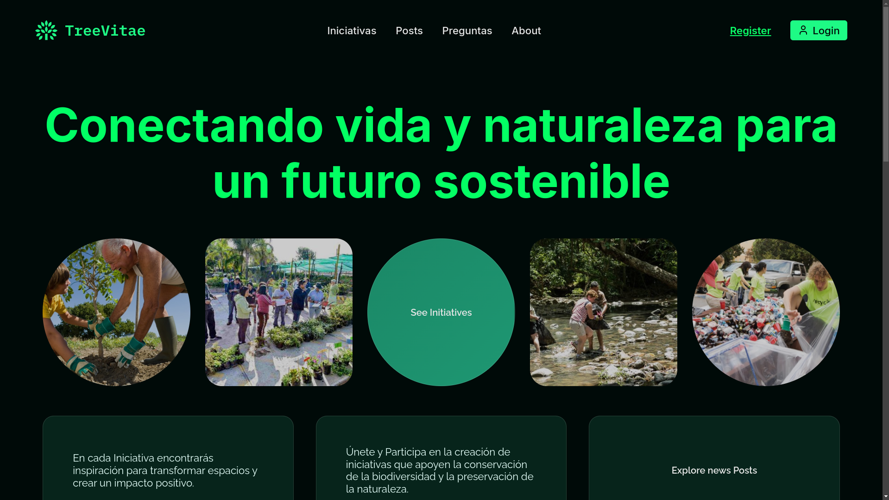

<!-- inspired by rxyhn's and AlphaTechnolog readme -->



<br>

<!-- BADGES -->
<div>
  <a href="#">
    
  </a>
  <a href="#">
    
  </a>
</div>

<h1 align="center" style="font-weight:mediun; padding:30px;">🌲 TreeVitae</h1>

this is a project that aims to connect nature and humanity for a sustainable future.

## 📝 Table of Contents

- [📝 Table of Contents](#-table-of-contents)
- [📦 Installation](#-installation)
- [🚀 Usage](#-usage)
- [📜 License](#-license)

## 📦 Installation

```bash
git clone https://github.com/Savecoders/TreeVitae.git
```

## 🚀 Usage

```bash
cd TreeVitae && code .
```

## 📜 License

This project is licensed under the MIT License - see the [LICENSE](LICENSE) file for details
